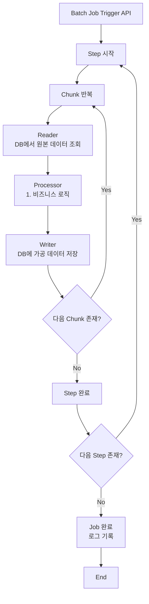

# Prompt for Batch processor

# Feature

- Name: Example
- API는 Trigger API만 생성, Entity는 Batch 내부에서 사용하므로 Entity에 관련한 API는 생성하지 않는다.

## Trigger API

### Example Batch 실행 API

POST
/api/batch/example/run

## Trigger Scheduler

## Batch Job



### Business logic

1. 비즈니스 로직
    - 원본 데이터 * 100

## Entity

```markdown
## 도메인: Example Raw Data

### 기능

- 원본 데이터를 저장한다.

### Entity

- id
- rawAmount: 원본 데이터 내용 (Integer)
- createdAt: 생성 일시
- ProcessedData: 1:1 가공 데이터

## 도메인: Example Processed Data

### 기능

- 가공한 데이터를 저장한다.

### Entity

- id
- processedAmount: 가공된 데이터 내용 (Integer)
- createdAt: 생성 일시
- RawData: 1:1 원본 데이터
```